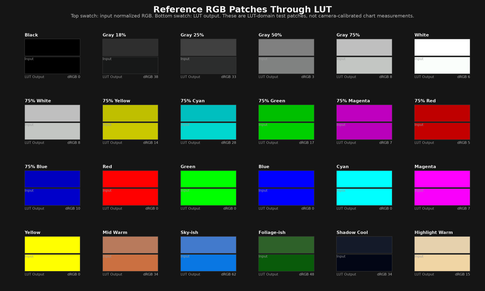
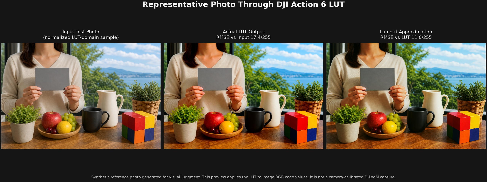

# lumetri-color-parser

Experimental tooling for fitting a 3D `.cube` LUT to an approximate Adobe Premiere Pro Lumetri Color **Basic Correction** slider model.

Live prototype: https://notoow.github.io/lumetri-color-parser/

The current prototype parses 3D LUTs, samples a gray ramp plus RGB grid, fits nine Lumetri-like parameters with least squares, and generates a diagnostic chart showing tone-curve and chroma-related error.

## What It Does

- Parses Iridas/Adobe 3D `.cube` LUT files.
- Samples LUT output with trilinear interpolation.
- Fits these Lumetri Basic Correction controls:
  - Exposure
  - Contrast
  - Highlights
  - Shadows
  - Whites
  - Blacks
  - Temperature
  - Tint
  - Saturation
- Reports RMSE in normalized `0-1` and 8-bit `0-255` units.
- Generates chart output from the latest fit result.
- Includes a static HTML prototype that mirrors the Premiere Lumetri panel layout.

## Important Caveat

This is a best-effort approximation, not an Adobe-authored reverse-engineering of Premiere internals.

Complex camera transform LUTs such as Log to Rec.709 often exceed what Basic Correction sliders can express. In those cases, the output is useful as the nearest Basic Correction-style estimate, not as exact LUT reconstruction.

## Setup

```powershell
python -m venv .venv
.\.venv\Scripts\Activate.ps1
pip install -r requirements.txt
```

## Run A Fit

```powershell
python fit_lut.py ".cube/[오즈모액션6] DJI OSMO Action 6 D-LogM to Rec.709 LUT-11.17.cube"
python make_chart.py
python make_reference_chart.py ".cube/[오즈모액션6] DJI OSMO Action 6 D-LogM to Rec.709 LUT-11.17.cube" -o docs/assets/action6_reference_transform.png --summary docs/assets/action6_reference_transform.json
python make_photo_preview.py docs/assets/representative_photo_input.png ".cube/[오즈모액션6] DJI OSMO Action 6 D-LogM to Rec.709 LUT-11.17.cube" --fit-summary outputs/fit_summary.json -o docs/assets/action6_representative_photo_comparison.png --output-json docs/assets/action6_representative_photo_comparison.json --lut-output docs/assets/action6_representative_photo_lut.png --lumetri-output docs/assets/action6_representative_photo_lumetri.png
```

Generated files are written to `outputs/`:

- `fit_results.npz`
- `fit_summary.json`
- `fit_chart.png`

Reference preview assets can be written to `docs/assets/` when they are meant to be published with GitHub Pages.

## Reference Patch Preview

There is no single universal RGB value for a physical 18% gray card inside a camera-log LUT. The chart below uses normalized LUT-domain test patches instead: neutral grays, 75% video color-bar values, Rec.709/sRGB primaries and secondaries, plus a few practical memory-color samples.



## Representative Photo Preview

For human visual judgment, this synthetic reference photo includes skin tone, a gray card, sky, foliage, white and black objects, warm wood, and saturated color blocks. The preview applies the LUT to the image's RGB code values, so it is a practical visual diagnostic rather than a camera-calibrated D-LogM capture.



## Files

- `lut_parser.py` - `.cube` parser and trilinear sampler.
- `lumetri_model.py` - approximate Lumetri Basic Correction model.
- `fit_lut.py` - least-squares fitting CLI.
- `make_chart.py` - diagnostic chart generator.
- `make_reference_chart.py` - before/after reference RGB patch chart generator.
- `make_photo_preview.py` - representative photo before/after comparison generator.
- `lumetri_decoder_prototype.html` - static UI prototype.
- `.cube/` - sample LUTs used for experiments.
